# 📊 DIAGRAMAS DEL SISTEMA TUTURNO - TESIS

> **Autor:** Moisés Aldas
> **Proyecto:** TuTurno - Sistema de Gestión de Citas B2B SaaS
> **Fecha:** Diciembre 2025
> **Formato:** Mermaid (compatible con GitHub, Mermaid Live Editor, Notion, VS Code)

---

## 📖 ÍNDICE DE DIAGRAMAS

| # | Diagrama | Tipo |
|---|----------|------|
| 1 | Arquitectura General del Sistema | Arquitectura |
| 2 | Diagrama Entidad-Relación (Base de Datos) | ER |
| 3 | Flujo de Autenticación | Flujo |
| 4 | Sistema de 3 Tipos de Cliente | Conceptual |
| 5 | Flujo de Crear Cita (4 Pasos) | Flujo |
| 6 | Diagrama de Secuencia - Crear Cita | Secuencia |
| 7 | Sistema Realtime (Tiempo Real) | Arquitectura |
| 8 | Sistema de Emails | Arquitectura |
| 9 | Flujo de Pagos y Facturación | Flujo |
| 10 | Estados de una Cita | Estados |
| 11 | Casos de Uso | Casos de Uso |
| 12 | Arquitectura de Seguridad (RLS) | Seguridad |
| 13 | Arquitectura de Capas | Arquitectura |
| 14 | Diagrama de Despliegue | Despliegue |
| 15 | Calendario B2B - Componentes | Componentes |
| 16 | Diagrama de Contexto del Sistema | Contexto |
| 17 | Diagrama de Flujo de Datos (DFD - Nivel 0) | DFD |
| 18 | Diagrama de Navegación de la Aplicación | Navegación |
| 19 | Diagrama de Clases (TypeScript Interfaces) | Clases |
| 20 | Especificación de API REST | API |
| 21 | Diccionario de Datos - Enumeraciones | Datos |
| 22 | Matriz de Permisos (RLS) | Seguridad |
| 23 | Patrones de Diseño Utilizados | Patrones |
| 24 | Arquitectura MVC Adaptada | MVC |
| 25 | Diagrama de Actividades - Reservar Cita (Cliente) | Actividades |
| 26 | Diagrama de Actividades - Gestionar Cita (Negocio) | Actividades |
| 27 | Métricas del Sistema | Métricas |
| 28 | Roadmap de Desarrollo Futuro | Timeline |
| 29 | Diagrama de Infraestructura Cloud | Infraestructura |
| 30 | Diagrama de Backup y Recuperación | Backup |

---

## 🔷 DIAGRAMAS

### 1. ARQUITECTURA GENERAL DEL SISTEMA

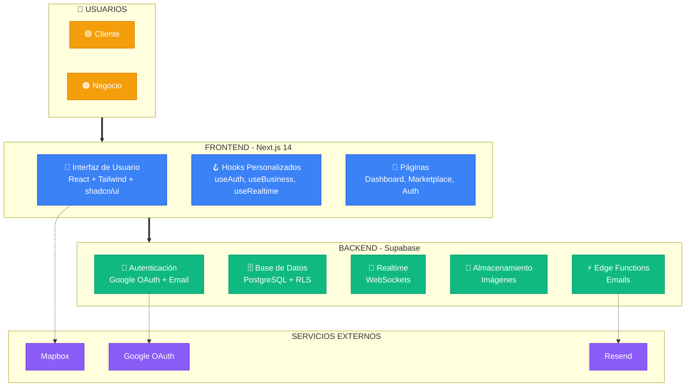

---

### 2. DIAGRAMA ENTIDAD-RELACIÓN (SIMPLIFICADO)

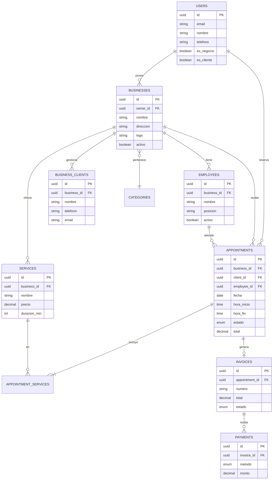

---

### 3. FLUJO DE AUTENTICACIÓN

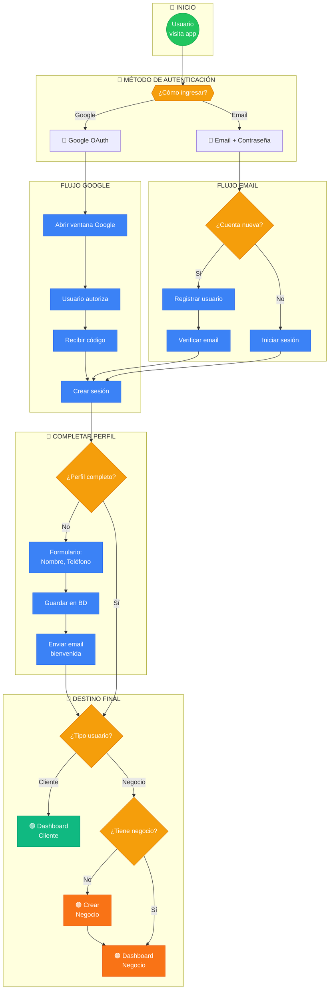

---

### 4. SISTEMA DE 3 TIPOS DE CLIENTE

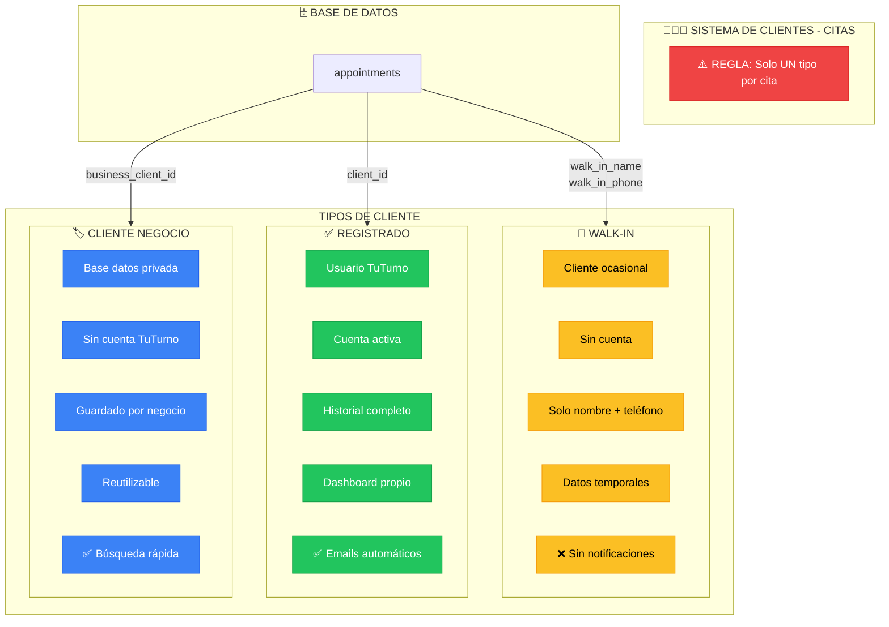

---

### 5. FLUJO DE CREAR CITA (4 PASOS)

```mermaid
flowchart LR
    subgraph STEP1["PASO 1️⃣"]
        S1_Title["👤 CLIENTE"]
        S1_1["Seleccionar tipo"]
        S1_2["Walk-in / Registrado /<br/>Cliente Negocio"]
    end

    subgraph STEP2["PASO 2️⃣"]
        S2_Title["💇 SERVICIOS"]
        S2_1["Elegir servicio(s)"]
        S2_2["Asignar empleado"]
        S2_3["Ver precio total"]
    end

    subgraph STEP3["PASO 3️⃣"]
        S3_Title["📅 FECHA Y HORA"]
        S3_1["Seleccionar fecha"]
        S3_2["Elegir hora inicio"]
        S3_3["Auto-calcular fin"]
    end

    subgraph STEP4["PASO 4️⃣"]
        S4_Title["✅ CONFIRMAR"]
        S4_1["Revisar resumen"]
        S4_2["Notas opcionales"]
        S4_3["Crear cita"]
    end

    STEP1 ==> STEP2 ==> STEP3 ==> STEP4

    subgraph RESULT["🎉 RESULTADO"]
        R1["Cita guardada"]
        R2["Email enviado"]
        R3["Calendario actualizado"]
    end

    STEP4 ==> RESULT

    classDef step1 fill:#ef4444,stroke:#dc2626,color:#fff
    classDef step2 fill:#f59e0b,stroke:#d97706,color:#fff
    classDef step3 fill:#3b82f6,stroke:#2563eb,color:#fff
    classDef step4 fill:#22c55e,stroke:#16a34a,color:#fff
    classDef result fill:#8b5cf6,stroke:#6d28d9,color:#fff

    class S1_Title,S1_1,S1_2 step1
    class S2_Title,S2_1,S2_2,S2_3 step2
    class S3_Title,S3_1,S3_2,S3_3 step3
    class S4_Title,S4_1,S4_2,S4_3 step4
    class R1,R2,R3 result
```

---

### 6. DIAGRAMA DE SECUENCIA - CREAR CITA

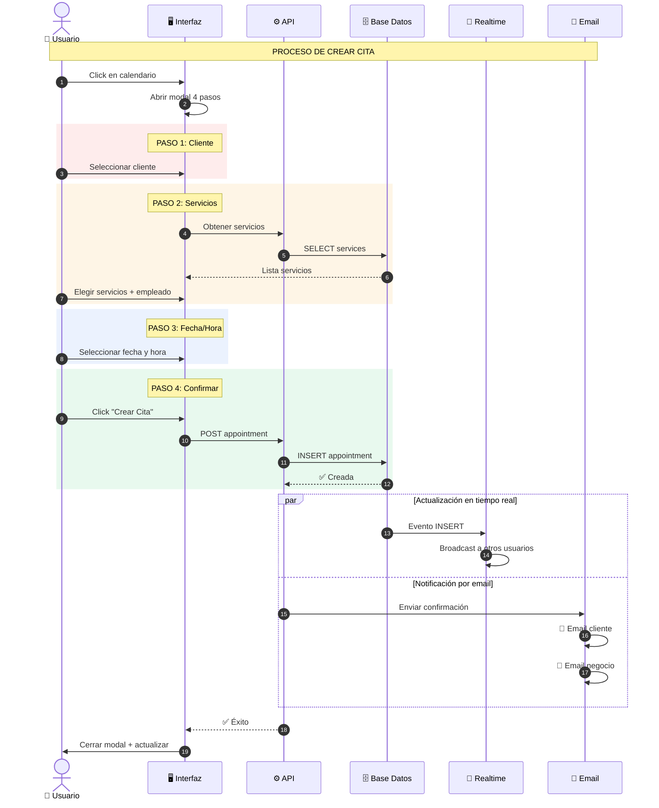

---

### 7. SISTEMA REALTIME (TIEMPO REAL)

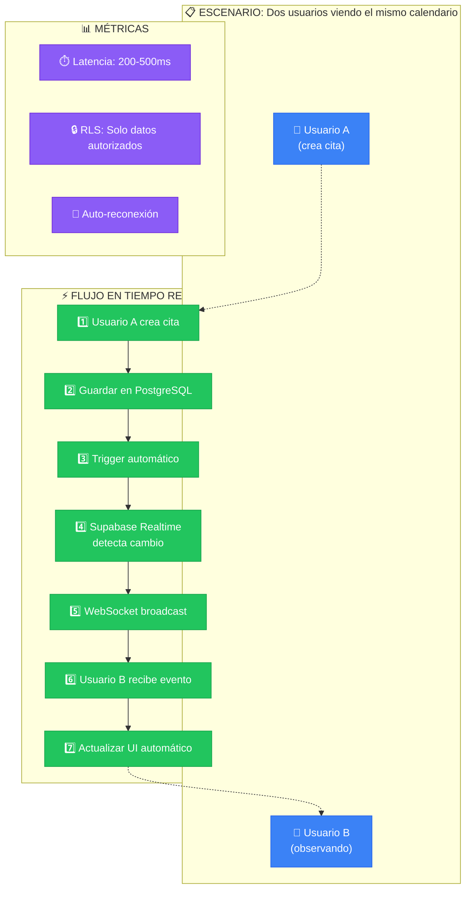

---

### 8. SISTEMA DE EMAILS

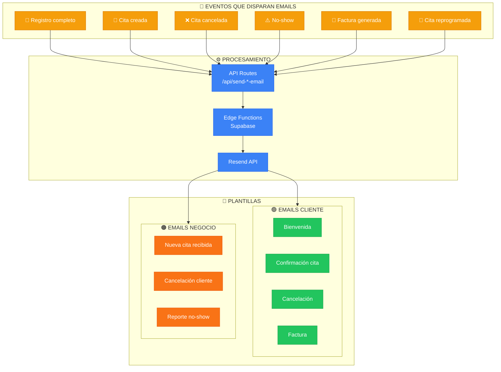

---

### 9. FLUJO DE PAGOS Y FACTURACIÓN

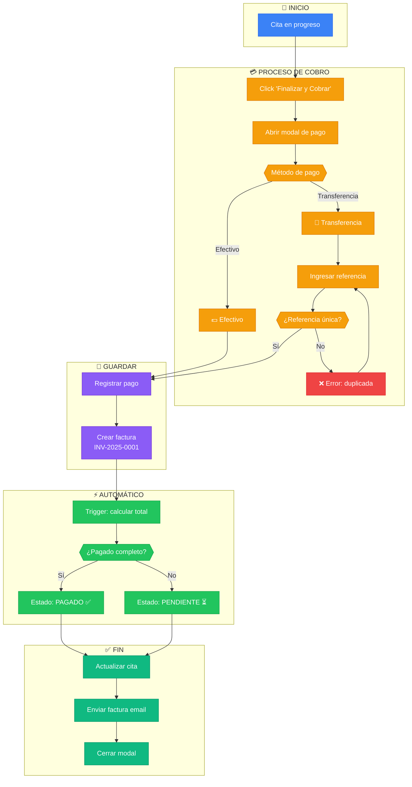

---

### 10. ESTADOS DE UNA CITA

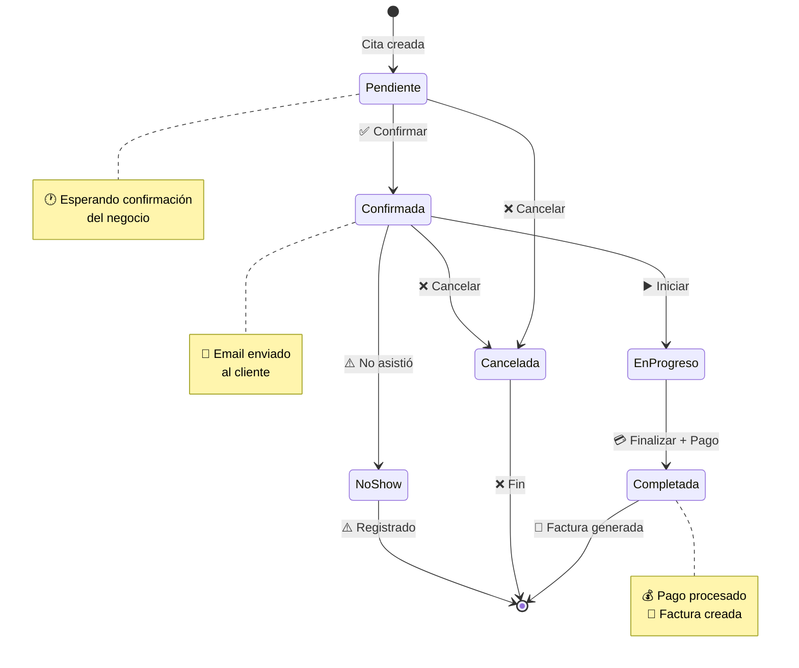

---

### 11. CASOS DE USO

```mermaid
flowchart TB
    subgraph ACTORS["👥 ACTORES"]
        Client["🟢 CLIENTE"]
        Owner["🟠 DUEÑO NEGOCIO"]
        System["⚙️ SISTEMA"]
    end

    subgraph CLIENT_UC["CLIENTE PUEDE..."]
        direction TB
        C1["🔐 Registrarse / Login"]
        C2["🔍 Buscar negocios"]
        C3["📅 Reservar cita"]
        C4["👁️ Ver mis citas"]
        C5["❌ Cancelar cita"]
        C6["⭐ Dejar reseña"]
    end

    subgraph OWNER_UC["DUEÑO PUEDE..."]
        direction TB
        O1["🏢 Crear negocio"]
        O2["👥 Gestionar empleados"]
        O3["💇 Gestionar servicios"]
        O4["📅 Ver calendario"]
        O5["➕ Crear cita walk-in"]
        O6["✏️ Editar citas"]
        O7["💳 Procesar pagos"]
        O8["⚙️ Configurar políticas"]
        O9["📊 Ver reportes"]
    end

    subgraph SYSTEM_UC["SISTEMA HACE..."]
        direction TB
        S1["📧 Enviar emails"]
        S2["🧾 Generar facturas"]
        S3["📡 Actualizar realtime"]
        S4["⏰ Programar recordatorios"]
    end

    Client --> CLIENT_UC
    Owner --> OWNER_UC
    System --> SYSTEM_UC

    C3 -.->|"dispara"| S1
    C3 -.->|"dispara"| S3
    O7 -.->|"dispara"| S2

    classDef client fill:#22c55e,stroke:#16a34a,color:#fff
    classDef owner fill:#f97316,stroke:#ea580c,color:#fff
    classDef system fill:#3b82f6,stroke:#2563eb,color:#fff

    class Client,C1,C2,C3,C4,C5,C6 client
    class Owner,O1,O2,O3,O4,O5,O6,O7,O8,O9 owner
    class System,S1,S2,S3,S4 system
```

---

### 12. ARQUITECTURA DE SEGURIDAD (RLS)

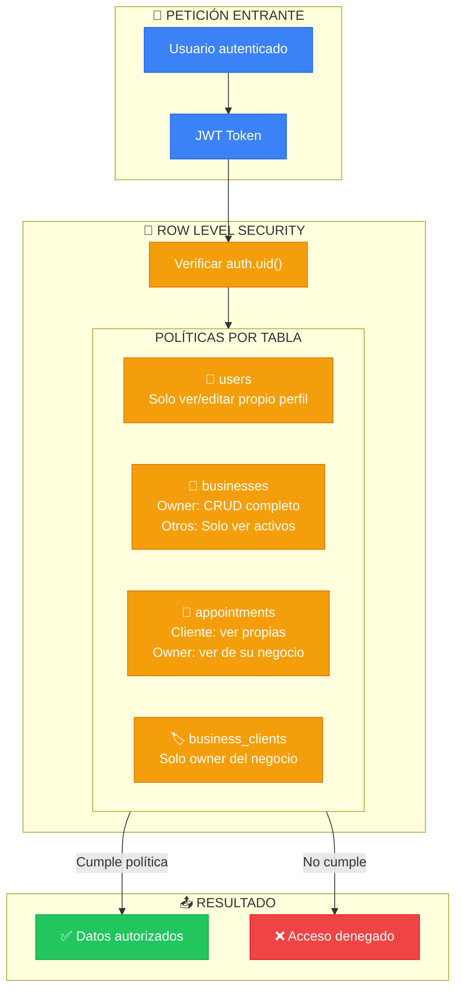

---

### 13. ARQUITECTURA DE CAPAS

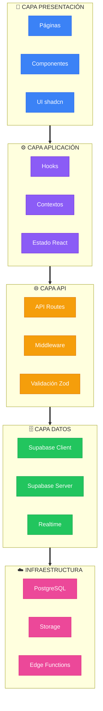

---

### 14. DIAGRAMA DE DESPLIEGUE

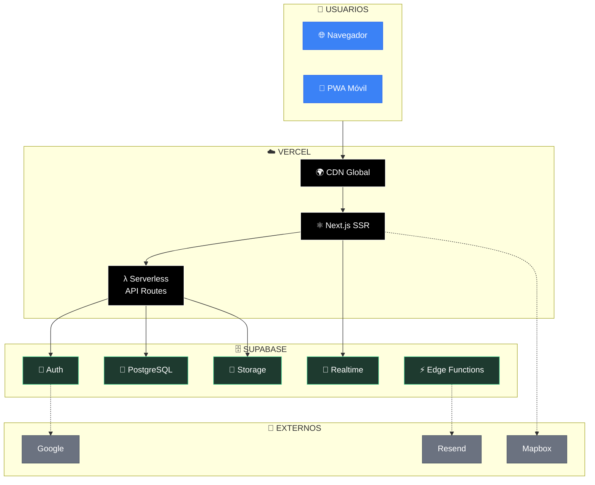

---

### 15. CALENDARIO B2B - COMPONENTES

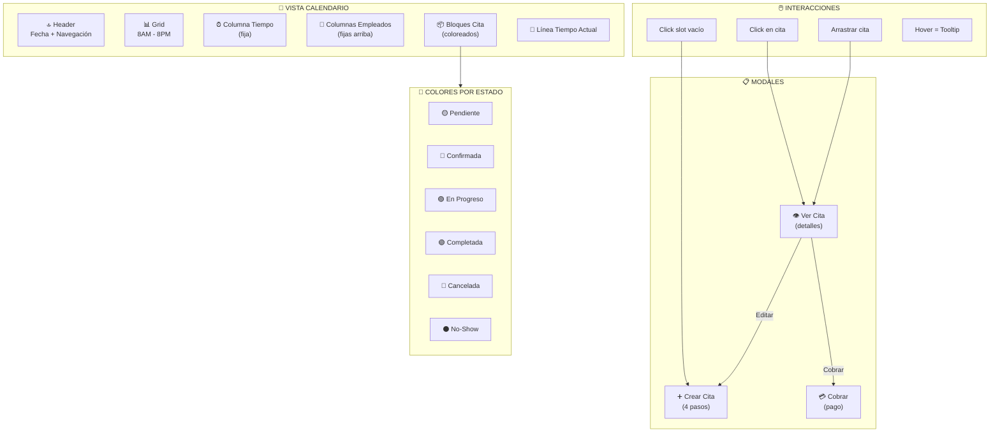

---

### 16. DIAGRAMA DE CONTEXTO DEL SISTEMA

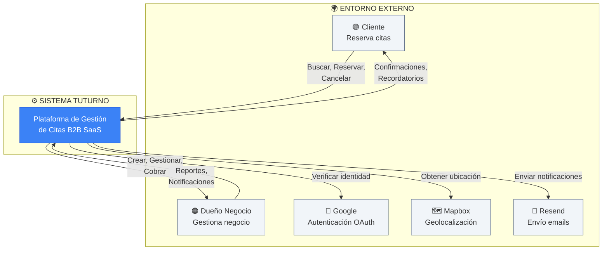

---

### 17. DIAGRAMA DE FLUJO DE DATOS (DFD - NIVEL 0)

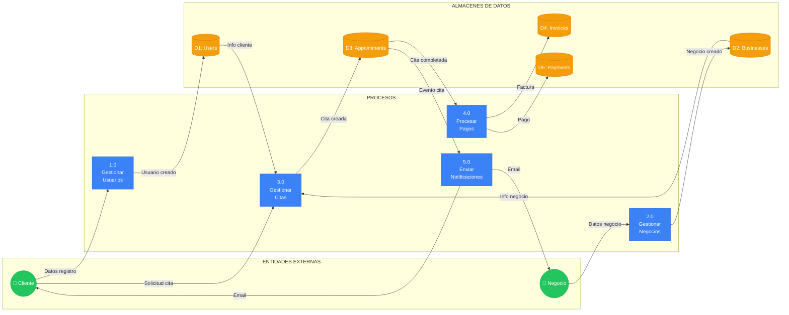

---

### 18. DIAGRAMA DE NAVEGACIÓN DE LA APLICACIÓN

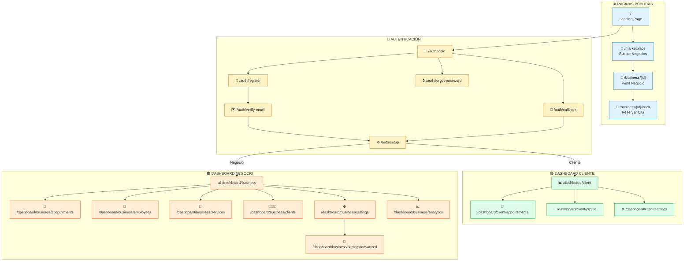

---

### 19. DIAGRAMA DE CLASES (TYPESCRIPT INTERFACES)

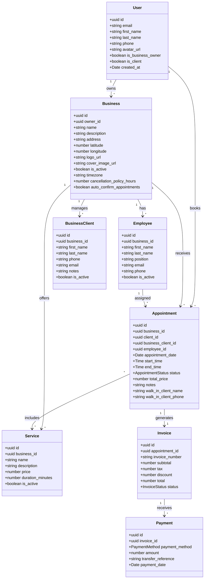

---

### 20. ESPECIFICACIÓN DE API REST

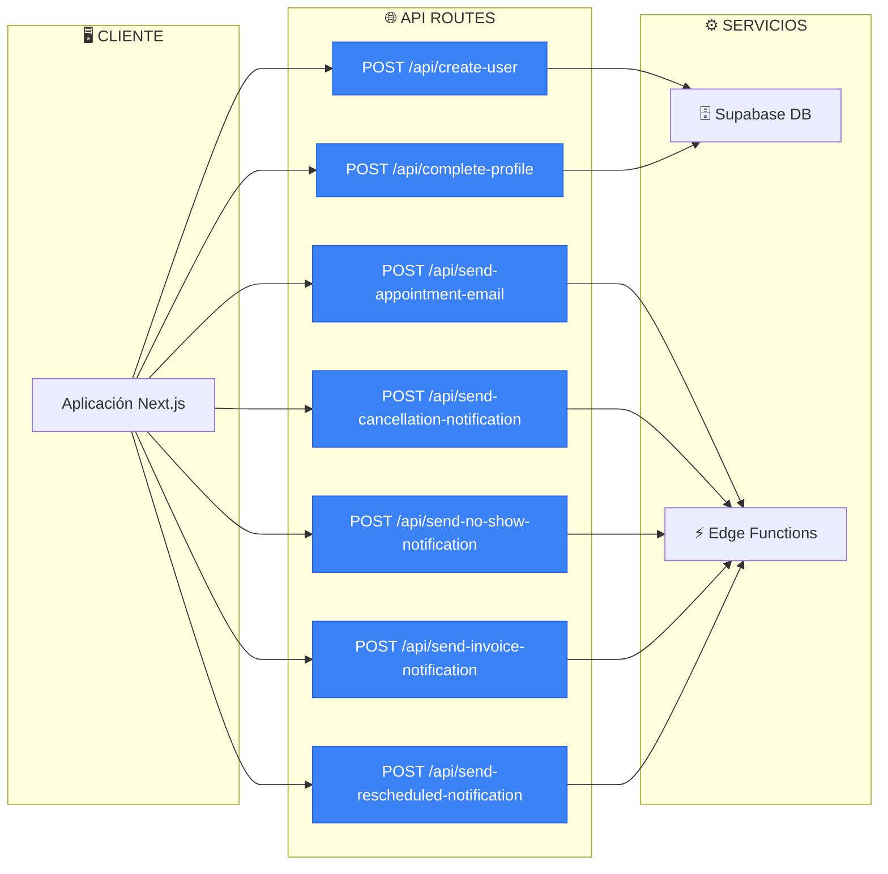

---

### 21. DICCIONARIO DE DATOS - ENUMERACIONES

```mermaid
flowchart LR
    subgraph STATUS["📊 appointment_status"]
        S1["pending"]
        S2["confirmed"]
        S3["in_progress"]
        S4["completed"]
        S5["cancelled"]
        S6["no_show"]
    end

    subgraph INVOICE["📄 invoice_status"]
        I1["pending"]
        I2["paid"]
        I3["cancelled"]
    end

    subgraph PAYMENT["💳 payment_method"]
        P1["cash"]
        P2["transfer"]
    end

    subgraph REMINDER["⏰ reminder_type"]
        R1["email"]
        R2["sms"]
        R3["push"]
    end

    classDef status fill:#3b82f6,stroke:#2563eb,color:#fff
    classDef invoice fill:#22c55e,stroke:#16a34a,color:#fff
    classDef payment fill:#f59e0b,stroke:#d97706,color:#fff
    classDef reminder fill:#8b5cf6,stroke:#6d28d9,color:#fff

    class S1,S2,S3,S4,S5,S6 status
    class I1,I2,I3 invoice
    class P1,P2 payment
    class R1,R2,R3 reminder
```

---

### 22. PATRONES DE DISEÑO UTILIZADOS

```mermaid
flowchart TB
    subgraph PATTERNS["🎯 PATRONES DE DISEÑO IMPLEMENTADOS"]
        direction TB

        subgraph CREATIONAL["CREACIONALES"]
            P1["🏭 Factory Pattern<br/>Creación de clientes Supabase"]
            P2["📦 Singleton Pattern<br/>Instancia única de Auth Context"]
        end

        subgraph STRUCTURAL["ESTRUCTURALES"]
            P3["🔌 Adapter Pattern<br/>Edge Functions → Resend API"]
            P4["🎭 Facade Pattern<br/>useAuth hook simplifica Auth"]
            P5["🧩 Composite Pattern<br/>Componentes UI anidados"]
        end

        subgraph BEHAVIORAL["COMPORTAMIENTO"]
            P6["👀 Observer Pattern<br/>Supabase Realtime subscriptions"]
            P7["📋 Strategy Pattern<br/>3 tipos de cliente"]
            P8["🔄 State Pattern<br/>Estados de cita"]
            P9["⛓️ Chain of Responsibility<br/>Middleware de rutas"]
        end
    end

    classDef creational fill:#3b82f6,stroke:#2563eb,color:#fff
    classDef structural fill:#22c55e,stroke:#16a34a,color:#fff
    classDef behavioral fill:#f59e0b,stroke:#d97706,color:#fff

    class P1,P2 creational
    class P3,P4,P5 structural
    class P6,P7,P8,P9 behavioral
```

---

### 23. ARQUITECTURA MVC ADAPTADA

```mermaid
flowchart TB
    subgraph VIEW["🎨 VISTA (View)"]
        direction TB
        V1["Pages (Next.js)"]
        V2["Components (React)"]
        V3["UI Library (shadcn)"]
    end

    subgraph CONTROLLER["⚙️ CONTROLADOR (Controller)"]
        direction TB
        C1["API Routes"]
        C2["Custom Hooks"]
        C3["Event Handlers"]
    end

    subgraph MODEL["🗄️ MODELO (Model)"]
        direction TB
        M1["Supabase Client"]
        M2["TypeScript Interfaces"]
        M3["Zod Schemas"]
    end

    subgraph DATABASE["💾 BASE DE DATOS"]
        DB["PostgreSQL + RLS"]
    end

    VIEW <-->|"Estado React"| CONTROLLER
    CONTROLLER <-->|"Queries/Mutations"| MODEL
    MODEL <-->|"SQL + RLS"| DATABASE

    classDef view fill:#3b82f6,stroke:#2563eb,color:#fff
    classDef controller fill:#22c55e,stroke:#16a34a,color:#fff
    classDef model fill:#f59e0b,stroke:#d97706,color:#fff
    classDef db fill:#8b5cf6,stroke:#6d28d9,color:#fff

    class V1,V2,V3 view
    class C1,C2,C3 controller
    class M1,M2,M3 model
    class DB db
```

---

### 24. DIAGRAMA DE ACTIVIDADES - RESERVAR CITA (CLIENTE)

```mermaid
flowchart TD
    Start(("🚀 Inicio"))

    A1["Buscar negocio en marketplace"]
    A2["Ver perfil del negocio"]
    A3{"¿Desea reservar?"}
    A4["Seleccionar servicio(s)"]
    A5["Seleccionar empleado"]
    A6["Elegir fecha disponible"]
    A7["Elegir hora disponible"]
    A8["Revisar resumen"]
    A9{"¿Confirmar?"}
    A10["Guardar cita en BD"]
    A11["Enviar email confirmación"]
    A12["Actualizar calendario realtime"]

    End1(("✅ Cita creada"))
    End2(("❌ Cancelado"))

    Start --> A1 --> A2 --> A3
    A3 -->|"Sí"| A4
    A3 -->|"No"| End2
    A4 --> A5 --> A6 --> A7 --> A8 --> A9
    A9 -->|"Sí"| A10
    A9 -->|"No"| A4
    A10 --> A11 --> A12 --> End1

    classDef start fill:#22c55e,stroke:#16a34a,color:#fff
    classDef action fill:#3b82f6,stroke:#2563eb,color:#fff
    classDef decision fill:#f59e0b,stroke:#d97706,color:#fff
    classDef end_ fill:#8b5cf6,stroke:#6d28d9,color:#fff

    class Start start
    class A1,A2,A4,A5,A6,A7,A8,A10,A11,A12 action
    class A3,A9 decision
    class End1,End2 end_
```

---

### 25. DIAGRAMA DE ACTIVIDADES - GESTIONAR CITA (NEGOCIO)

```mermaid
flowchart TD
    Start(("🚀 Ver Calendario"))

    A1{"¿Tipo de acción?"}

    subgraph CREATE["➕ CREAR CITA"]
        C1["Click en slot vacío"]
        C2["Seleccionar cliente"]
        C3["Elegir servicios"]
        C4["Confirmar cita"]
    end

    subgraph VIEW["👁️ VER/EDITAR"]
        V1["Click en cita existente"]
        V2["Ver detalles"]
        V3{"¿Acción?"}
        V4["Editar datos"]
        V5["Cambiar estado"]
        V6["Cancelar cita"]
    end

    subgraph CHECKOUT["💳 COBRAR"]
        CH1["Click Finalizar"]
        CH2["Seleccionar método pago"]
        CH3["Registrar pago"]
        CH4["Generar factura"]
    end

    End1(("✅ Completado"))

    Start --> A1
    A1 -->|"Crear"| C1 --> C2 --> C3 --> C4 --> End1
    A1 -->|"Ver/Editar"| V1 --> V2 --> V3
    V3 -->|"Editar"| V4 --> End1
    V3 -->|"Estado"| V5 --> End1
    V3 -->|"Cancelar"| V6 --> End1
    V3 -->|"Cobrar"| CH1
    A1 -->|"Cobrar"| CH1 --> CH2 --> CH3 --> CH4 --> End1

    classDef start fill:#22c55e,stroke:#16a34a,color:#fff
    classDef create fill:#3b82f6,stroke:#2563eb,color:#fff
    classDef view fill:#f59e0b,stroke:#d97706,color:#fff
    classDef checkout fill:#8b5cf6,stroke:#6d28d9,color:#fff
    classDef decision fill:#ec4899,stroke:#db2777,color:#fff

    class Start,End1 start
    class C1,C2,C3,C4 create
    class V1,V2,V4,V5,V6 view
    class CH1,CH2,CH3,CH4 checkout
    class A1,V3 decision
```

---

### 26. MÉTRICAS DEL SISTEMA

```mermaid
flowchart TB
    subgraph METRICS["📊 MÉTRICAS DEL SISTEMA TUTURNO"]
        direction TB

        subgraph CODE["📝 CÓDIGO"]
            M1["99 Componentes React"]
            M2["8 Custom Hooks"]
            M3["7 API Routes"]
            M4["~15,000 líneas de código"]
            M5["100% TypeScript"]
        end

        subgraph DB["🗄️ BASE DE DATOS"]
            M6["11 Tablas principales"]
            M7["20+ Políticas RLS"]
            M8["5 Triggers automáticos"]
            M9["4 Funciones SQL"]
            M10["18 Foreign Keys"]
        end

        subgraph PERF["⚡ RENDIMIENTO"]
            M11["Realtime: <500ms latencia"]
            M12["Bundle: ~350KB gzipped"]
            M13["Lighthouse: 90+ score"]
            M14["First Load: <3s"]
        end

        subgraph FEATURES["✅ FUNCIONALIDADES"]
            M15["100% Features completas"]
            M16["7 tipos de email"]
            M17["3 tipos de cliente"]
            M18["6 estados de cita"]
            M19["2 métodos de pago"]
        end
    end

    classDef code fill:#3b82f6,stroke:#2563eb,color:#fff
    classDef db fill:#22c55e,stroke:#16a34a,color:#fff
    classDef perf fill:#f59e0b,stroke:#d97706,color:#fff
    classDef features fill:#8b5cf6,stroke:#6d28d9,color:#fff

    class M1,M2,M3,M4,M5 code
    class M6,M7,M8,M9,M10 db
    class M11,M12,M13,M14 perf
    class M15,M16,M17,M18,M19 features
```

---

### 27. ROADMAP DE DESARROLLO FUTURO

```mermaid
timeline
    title Roadmap TuTurno 2025-2026

    section Q4 2025
        Noviembre : Dashboard Analytics
                  : Gráficos de ventas
                  : Reportes por empleado
        Diciembre : SMS Reminders
                  : Integración Twilio
                  : Recordatorios WhatsApp

    section Q1 2026
        Enero : App Móvil React Native
              : iOS App Store
              : Android Play Store
        Febrero : Multi-idioma
                : Inglés
                : Portugués
        Marzo : API Pública
              : Documentación Swagger
              : SDK JavaScript

    section Q2 2026
        Abril : Video Consultas
              : Integración Zoom/Meet
              : Sala virtual
        Mayo : IA Scheduling
             : Optimización horarios
             : Predicción demanda
        Junio : Pasarela Pagos
              : Stripe integration
              : PayPal

    section Q3 2026
        Julio : Multi-sucursal
              : Gestión centralizada
              : Dashboard corporativo
        Agosto : Marketplace V2
               : Reviews verificados
               : Sistema de puntos
        Septiembre : White-label
                   : Personalización total
                   : Subdominios
```

---

### 28. DIAGRAMA DE INFRAESTRUCTURA CLOUD

```mermaid
flowchart TB
    subgraph USERS["👥 USUARIOS"]
        Browser["🌐 Navegador"]
        Mobile["📱 Móvil PWA"]
    end

    subgraph CDN["🌍 CDN LAYER"]
        Vercel["Vercel Edge Network<br/>Cache + SSL"]
    end

    subgraph COMPUTE["⚙️ COMPUTE LAYER"]
        NextJS["Next.js App<br/>SSR + API Routes"]
        Serverless["Serverless Functions<br/>API Endpoints"]
    end

    subgraph SUPABASE["🗄️ SUPABASE CLOUD"]
        subgraph AUTH["Auth"]
            GoTrue["GoTrue Server<br/>JWT + OAuth"]
        end

        subgraph DATABASE["Database"]
            Postgres["PostgreSQL 15<br/>+ RLS + Triggers"]
            PgBouncer["PgBouncer<br/>Connection Pooling"]
        end

        subgraph REALTIME["Realtime"]
            RealtimeServer["Realtime Server<br/>Phoenix/Elixir"]
            WebSocket["WebSocket<br/>Connections"]
        end

        subgraph STORAGE["Storage"]
            S3["S3-Compatible<br/>Object Storage"]
            ImgProxy["Image Transform<br/>Resize/Optimize"]
        end

        subgraph EDGE["Edge Functions"]
            Deno["Deno Runtime<br/>V8 Isolates"]
        end
    end

    subgraph EXTERNAL["🔗 EXTERNAL SERVICES"]
        Google["Google OAuth"]
        Resend["Resend SMTP"]
        Mapbox["Mapbox API"]
    end

    USERS --> CDN --> COMPUTE
    NextJS --> AUTH
    NextJS --> DATABASE
    NextJS --> REALTIME
    NextJS --> STORAGE
    Serverless --> DATABASE
    AUTH --> Google
    Deno --> Resend
    NextJS --> Mapbox
    DATABASE --> PgBouncer --> Postgres

    classDef users fill:#3b82f6,stroke:#2563eb,color:#fff
    classDef cdn fill:#22c55e,stroke:#16a34a,color:#fff
    classDef compute fill:#f59e0b,stroke:#d97706,color:#fff
    classDef supabase fill:#1e3a2f,stroke:#3ecf8e,color:#fff
    classDef external fill:#8b5cf6,stroke:#6d28d9,color:#fff

    class Browser,Mobile users
    class Vercel cdn
    class NextJS,Serverless compute
    class GoTrue,Postgres,PgBouncer,RealtimeServer,WebSocket,S3,ImgProxy,Deno supabase
    class Google,Resend,Mapbox external
```

---

### 29. DIAGRAMA DE BACKUP Y RECUPERACIÓN

```mermaid
flowchart TB
    subgraph BACKUP["🔄 ESTRATEGIA DE BACKUP"]
        direction TB

        subgraph AUTO["AUTOMÁTICO (Supabase)"]
            A1["📅 Backup diario"]
            A2["⏰ Retención 7 días"]
            A3["🌍 Replicación geográfica"]
        end

        subgraph MANUAL["MANUAL"]
            M1["pg_dump semanal"]
            M2["Export CSV mensual"]
            M3["Storage backup"]
        end

        subgraph PITR["POINT-IN-TIME RECOVERY"]
            P1["Recuperación a cualquier punto"]
            P2["Últimas 7 días"]
            P3["Granularidad: segundos"]
        end
    end

    subgraph RECOVERY["🔧 PROCESO DE RECUPERACIÓN"]
        R1["1. Identificar punto de falla"]
        R2["2. Acceder Supabase Dashboard"]
        R3["3. Database → Backups"]
        R4["4. Seleccionar fecha/hora"]
        R5["5. Restore to new project"]
        R6["6. Verificar integridad"]
        R7["7. Actualizar DNS/variables"]
    end

    AUTO --> RECOVERY
    PITR --> RECOVERY
    R1 --> R2 --> R3 --> R4 --> R5 --> R6 --> R7

    classDef backup fill:#3b82f6,stroke:#2563eb,color:#fff
    classDef recovery fill:#22c55e,stroke:#16a34a,color:#fff

    class A1,A2,A3,M1,M2,M3,P1,P2,P3 backup
    class R1,R2,R3,R4,R5,R6,R7 recovery
```

---

## 📥 CÓMO USAR ESTOS DIAGRAMAS

### Opción 1: Mermaid Live Editor (Recomendado)
1. Ve a: https://mermaid.live/
2. Copia el código del diagrama
3. Pégalo en el editor
4. Exporta como PNG, SVG o PDF

### Opción 2: GitHub
1. Crea un README.md
2. Pega los diagramas (GitHub renderiza Mermaid automáticamente)

### Opción 3: VS Code
1. Instala extensión "Markdown Preview Mermaid Support"
2. Crea archivo .md con los diagramas
3. Abre preview (Ctrl+Shift+V)

### Opción 4: Notion
1. Crea bloque de código
2. Cambia lenguaje a "Mermaid"
3. Pega el código

---

**Generado:** Diciembre 2025
**Proyecto:** TuTurno - Sistema de Gestión de Citas B2B SaaS
**Total de Diagramas:** 29
